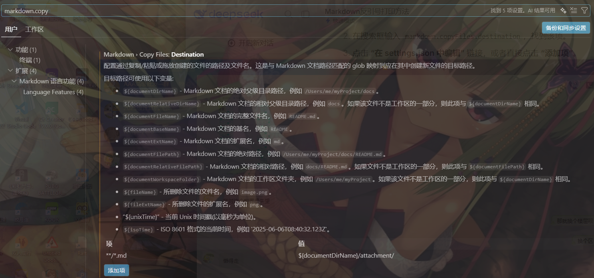
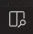

# 标题

# 一级标题
## 二级标题
### 三级标题
...
###### 六级标题

**使用方法：** 使用N个`#`+一个`' '`，将这一行转化为N级标题，如`### 三级标题`

# 分条

## 带数字的分条：
1. 第一条
2. 第二条

**使用方法：** `x`+`'.'`+`' '`，将这一行转化为带数字分条格式，如`3. 第三条`


## 不带数字的分条：
- 第一条
- 第二条

**使用方法：** `'-'`+`' '`，将这一行转化为不带数字分条格式，如`- 第三条`

## 分条的子分类:
1. 一
    1. 一.1
    2. 一.2
        1. 一.2.1
2. 二
    - 二-1
        1. 二-1-1
    - 二-2

**使用方法：** 在某一分类处采用`Shift+Tab`快捷键，可以换行并且不延续该分类的编号，再用`Tab`进行分级（需要自行尝试才好理解）

## 待办项
- [ ] 第一条（未完成）
- [x] 第二条（已完成）

**使用方法：** `'-'`+`' '`+`[ ]`+`' '`，将这一行转化为待办项（将`[ ]`改为`[x]`表示已完成），如
`- [ ] 第一条（未完成）`
`- [x] 第二条（已完成）`

# 字体
**加粗字体** ：`**加粗字体**`
*斜体* ：`*斜体*`
~~删除线~~ ：`~~删除线~~`
<mark>高亮字体</mark> ：`<mark>高亮字体</mark>`（html代码）
<font color="red">红色字体</font> ：`<font color="red">红色字体</font>`（html代码）

# 代码块
`这是一个代码块（单行）` ：`` `这是一个代码块（单行）` ``
```C++
#include<bits/stdc++.h>
int main()
{
    cout<<"Hello N0Ne_Zre0!";
}
```
**使用方法：** (该符号`` ` ``为Tab上方的键位，用英文输入法输出)
````
```
代码
```
````

# 插入网页链接
[参考视频](https://www.bilibili.com/video/BV1JJREB9ENC/?spm_id_from=333.1391.0.0&vd_source=f6d8f31dead5ce840ea7d3e1260d0ff4)
**使用方法：** `[备注](链接)`
在vscode中，直接粘贴链接后，右下角有按钮，选择markdown格式粘贴后，会让你在中括号中填入备注名。

# 粘贴图片


**使用方法：** 在vscode环境下，直接粘贴在md文档中，此时文件默认路径为何md文件同级的文件夹中。
修改路径方法为上图所示，打开vscode**设置**，搜索`markdown.copy`，在**Destination**中添加项`**/*.md`，表示对所有的md文件，添加值`${documentDirName}/${documentBaseName}/`，即md文件的绝对父级目录路径，在该路径下创建**同名**文件夹，将图片存入该文件夹中（可自行修改）。

# 在vscode中配置MarkDown
首先下载两个基础的扩展 **Markdown All in One** 和 **Markdown Preview Enhanced** 创建.md并打开后，右上角有  点击该按钮后会出现分屏，右边即md格式渲染区。


# 资料参考
[参考视频](https://www.bilibili.com/video/BV1JJREB9ENC/?spm_id_from=333.1391.0.0&vd_source=f6d8f31dead5ce840ea7d3e1260d0ff4)
