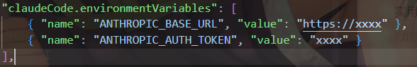

### 下载cc插件
首先再vscode中下载插件 **Claude Code for VS Code** ，完成后在右上角会有图片  ，这就是打开ClaudeCode对话的按钮，点开后会有登录认证，如果使用的不是Claude模型，那么就要准备绕过认证。

### 绕过cc认证
打开vscode设置，搜索 **Claude Code: Environment Variables** 点击`Edit in settings.json`。
添加以下字段并**调整**至如图所示

```json
{ "name": "ANTHROPIC_BASE_URL", "value": "https://xxxx" },
{ "name": "ANTHROPIC_AUTH_TOKEN", "value": "xxxx" }
```
随后重新打开claudecode对话界面，就绕过了认证。

### 下载cc switch
*该步骤需要访问github，一个简单的方法就是下载Watt Toolkit（原名steam++），在加速服务中选择github并加速。*
访问网站[cc-switch](https://github.com/farion1231/cc-switch/releases)，下划至**Assets**，展开全部，下载对应文件（Windows选择 **...Windows.msi** 下载），然后打开该文件进行安装（请下载到合适的目录）

### 接入你的模型
打开cc switch后，点击右上角的**加号**，选择你拥有的模型供应商，填入你的**API Key**，并更改模型名字，点击添加后，回到主页面选择并使用，就可以在vscode中愉快的使用AI了。

# 参考资料
[参考视频](https://www.bilibili.com/video/BV1kPoBBHEXS/?spm_id_from=333.1391.0.0&vd_source=f6d8f31dead5ce840ea7d3e1260d0ff4)
