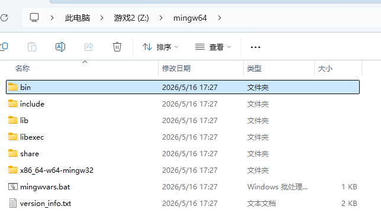
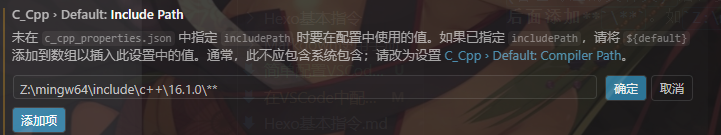
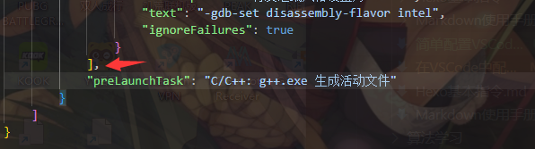

## 安装工具链
*检查一下自己这一步是否已完成，在终端里输入`g++ -v`，如果正确显示路径则本步骤可跳过，记录一下到`\mingw64`文件夹的路径即可*
1. 下载MinGW-w64，推荐网站 https://winlibs.com/ ，往下翻选择一个心仪的版本下载解压就好了。
2. 打开MinGW文件夹，再打开`\bin`文件夹，记录`\bin`文件夹路径后，打开**高级系统设置**，在**高级**一栏中点击**环境变量**，在下方系统中找到`Path`，双击点开后，电机右侧新建，输入记录的`\bin`文件夹路径，如`..(自己解压的位置)\mingw64\bin`，随后一路点击确定即可，再用上面的方法检验是否完成。

## 安装VSCode插件
（中文插件就不在这里说明了）
下载插件 `C/C++` 和 `C/C++ Compile Run`。
打开插件`C/C++`的设置，需要修改三个位置。
1. `Cpp Standard` ：改为对应C++标准（竞赛一般用c++17）
2. `Include Path` ：点击**添加项**，复制文件夹路径。打开`\mingw64`文件夹，依次打开`\include`、`c++`、`\xx.x.x(自己对应的文件夹)`后，复制路径，粘贴到对应位置，**并在后面添加**`\**`。如`Z:\mingw64\include\c++\16.1.0\**`。

3. `Intelli Sense Mode` ：修改为windows-gcc-x64，这是代码智能补全的设置。

打开插件`C/C++ Compile Run`，修改一个位置
1. `Run-in-external-terminal` ：让程序运行在外部终端。

## 创建工作区，并生成配置文件
创建自己的工作区文件夹，用VSCode打开文件夹后，按`Ctrl+Shift+P`，进行以下操作。点击**配置任务**，会自动生成`.vscode\tasks.json`文件，注意`"command"和"detail"`是否指向了`g++.exe`即可。
**至此，在工作区创建cpp文件就可以按F6正常编译运行了。**
但我们发现仍然无法调试。
点开左侧Debug栏，有`创建一个launch.json文件`蓝字，点击后选择**C++(GDB/LLDB)**，自动生成了`launch.json`，点击右下角添加配置，选择**C++ gdb启动**。
顺便在下方添加`"preLaunchTask": "C/C++: g++.exe 生成活动文件"`，在每次调试前进行一次编译操作。（注意上面的逗号）

**至此，可以添加断点按F5进行调试了**

## 推荐一些美化插件
`Better C++ Syntax` ：让代码更加好看。
`Windows opacity` ：设置VSCode窗口透明度。
`background` ：自定义VSCode界面背景图。