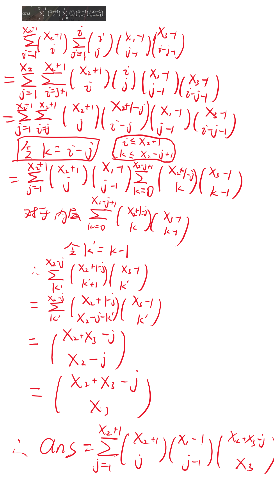

**没错，今天是520，我没有和女朋友一起过，也没有女朋友
~~但是我可以和题解一起过~~**
**T^T**

## A

### 问题陈述
给你一个由小写英文字母和正整数 $N$ 组成的字符串 $S$ 。 $S$ 的长度至少为 $2N+1$ 。
求从 $S$ 的开头删除 $N$ 个字符和从结尾删除 $N$ 个字符后得到的字符串。


#### 思路：
设$S$长度为$L$，输出$S$的第$N+1$到第$L-N$个字符即可，由于$S$下标从$0$开始，即输出$S_N$至$S_{L-N-1}$。

**Code**
```C++
    string S;
    cin>>S;
    int N;
    cin>>N;
    for(int i=N;i<=S.size()-N-1;i++)
    {
        cout<<S[i];
    }
```

## B

### 问题陈述
有一个网格，网格中有 $H$ 行和 $W$ 列。从顶部起第 $i$ 行，从左侧起第 $j$ 列的单元格称为单元格 $(i, j)$ 。
当 $|x_1 - x_2| + |y_1 - y_2| = 1$ 时， $(x_1, y_1)$ 和 $(x_2, y_2)$ 单元格被称为**相邻边**。
请找出与每个单元格边相邻的单元格数。


#### 思路：
对于一个格子$(i,j)$，设它的相邻格数为4，如果它靠近上下边缘则减1，靠近左右边缘则减少1，显然最小数为2，遍历即可。

**Code**
```C++
    int H,W;
    cin>>H>>W;
    for(int i=1;i<=H;i++)
    {
        for(int j=1;j<=W;j++)
        {
            int ans=4;
            if(i==1)ans--;
            if(i==H)ans--;
            if(j==1)ans--;
            if(j==W)ans--;
            cout<<ans<<' ';
        }
        cout<<'\n';
    }
```

## C

### 问题陈述
给你一个由大写英文字母组成的字符串 $S$ 。  
请找出满足以下所有条件的 $S$ 的子串（连续子序列）的个数。
- 由奇数个字符组成。
- 它的中间字符是 `C`。更正式地说，如果提取的子串由 $l$ 个字符组成，那么它的 $((l+1)/2)$ 个字符就是 `C`。
即使两个子串作为字符串是完全相同的，如果它们是从不同的位置提取出来的，也会被分开计算。


#### 思路：
由于只求字符$C$为中心的连续子序列个数，我们只考虑每个$C$对答案的贡献。
设$S$长度为$L$，对于某一个$C$，如果他的下标为i，即$S_i=C$时，对答案的贡献为从$i$到最左侧$0$，以及到最右侧$L-1$的距离取最小值，也就是$ans+=\min{(i+1,L-i)}$。

**Code**
```C++
    string S;
    cin>>S;
    int ans=0;
    for(int i=0;i<S.size();i++)
    {
        if(S[i]=='C')
        {
            int tem=min(i+1ull,S.size()-i);
            ans+=tem;
        }
    }
    cout<<ans;
```

## D

### 问题陈述

黑板上写着一个整数 $X$ 。

给你 $Q$ 个查询，让你按顺序处理。 $i$ \-th 查询 $(1 \le i \le Q)$ 如下。
> 给出两个整数 $A_i$ 和 $B_i$ 。在黑板上写下两个新的整数 $A_i$ 和 $B_i$ 。
> 然后，输出写在黑板上的 $2i+1$ 个整数的中位数。


#### 分析：
黑板上初始有一个整数$X$，随后每次增加2个数字，并询问黑板上数字的中位数是多少。如果每次询问都插入后排序求结果的话，时间复杂度为$O(Q^2\log Q)$，显然无法通过该题，那么我们换个思路。
由于每次只加入两个数字$A,B$，假设在加入前数列有序，中位数为$M$，那么有三种情况：
- 当$A$和$B$均小于$M$，则中位数会左移一位。
- 当$A$和$B$均大于$M$，则中位数会右移一位。
- 当$A$和$B$其中一个大于$M$，另一个小于$M$，则中位数不变，仍为$M$。

实际上，中位数只会每次移动一个位置，添加数后需要找到和$M$相邻的数即为答案（保证有序）。
#### 思路：
由于中位数两边均有序，我们可以维护两个大小相同的**堆**，小于中位数则放入大根堆，大于中位数则放入小根堆，随后平衡两者的大小，堆顶即为答案。（由于总数为奇数个，我们可以复制一份堆顶放入大小根堆，在平衡前弹出并保留）
*tips：对于小根堆的处理，可以直接在入堆时取反，取出时再取反即可。*

复杂度$O(Q\log Q)$

**Code**
```C++
void sol()
{
    int X;
    cin>>X;
    que1.push(X);
    que2.push(-X);
    int Q;
    cin>>Q;
    while(Q--)
    {
        int A,B;
        cin>>A>>B;
        int tem=que1.top();
        que1.pop();
        que2.pop();
        if(A<=tem)que1.push(A);
        else que2.push(-A);
        if(B<=tem)que1.push(B);
        else que2.push(-B);

        if(que1.size()>que2.size())
        {
            int t=que1.top();
            que2.push(-tem);
            que2.push(-t);
            tem=t;
        }
        else if(que1.size()<que2.size())
        {
            int t=-que2.top();
            que1.push(tem);
            que1.push(t);
            tem=t;
        }
        else
        {
            que1.push(tem);
            que2.push(-tem);
        }
        cout<<tem<<'\n';
    }
}
```

# 补题
**本次比赛依旧做出4个题，实际上半小时就完成了，后面一小时一直在看G题，但是G确实很难...**

## E

### 问题陈述
求长度为 $X_1+X_2+X_3$ 的序列 $A = (a_1, \cdots, a_{X_1 + X_2 + X_3})$ 中，满足以下所有条件的模数 $998244353$ 的个数。
- $A$ 恰好包含 $1$ 的 $X_1$ 份， $2$ 恰好包含 $X_2$ 份， $3$ 恰好包含 $X_3$ 份。
- 相邻元素之间的绝对差最多为 $1$ 。也就是说，对于满足 $1 \leq i \leq X_1+X_2+X_3-1$ 的每一个整数 $i$ ，我们都有 $|a_{i+1} - a_i| \leq 1$ 。


#### 分析：
相邻元素绝对值差最多为1，也就是说对于1和3来说，两侧要么相同为1或3，要么为2，也就是说2将1和3**隔开**了，那么这就转化为了一个数学题。
#### 思路：
由于如果将2视作隔板，插入1和3的序列中，我们无法统计1和3相邻的位置有多少（因为这些位置必须放入非0个2），所以我们转换思路，在全是2的序列中插入连续的1或者3。
对于$X_2$个2，我们有$X_2+1$个位置可以插入1或3，因此需要在其中选择$i$个位置，即$\binom{X_2+1}{i}$，随后在这$i$个位置中，我们需要选择$j$个位置插入1，$i-j$个位置插入3，也就是$\binom{i}{j}$，两者是相似的情况，这里只解释选择$j$个位置插入1有多少种情况。
对于$X_1$个1，我们需要将他们分为$j$份，也就是说我们要选择$j-1$个隔板，而一共有$X_1-1$个可以做隔板的位置，那么一共有$\binom{X_1-1}{j-1}$。
同理对于3来说共有$\binom{X_3-1}{i-j-1}$。
所以最终的答案为$ans=\sum\limits_{i=1}^{X_2+1}\binom{X_2+1}{i}\sum\limits_{j=0}^{i}\binom{i}{j}\binom{X_1-1}{j-1}\binom{X_3-1}{i-j-1}$。

化简结果为$\sum\limits_{k=1}^{X_2+1}\binom{X_2+1}{k}\binom{X_1-1}{k-1}\binom{X_2+X_3-k}{X_3}$。

**推导过程just be like：** *（在本图中有一些错误，比如求和上下界有问题，不要在意...）*


*组合数处理时涉及逆元，这里先不做介绍~*

**Code**
```C++
int fac[maxn],invfac[maxn];

int qp(int x,int y)
{
    if(y==1)return 1;
    if(x==0)return 0;
    if(x==1)return 1;
    int ans=1,tem=x;
    while(y)
    {
        if(y&1)ans=ans*tem%mod;
        tem=tem*tem%mod;
        y>>=1;
    }
    return ans%mod;
}
int C(int x,int y)
{
    if(x<y)return 0;
    return fac[x]*invfac[y]%mod*invfac[x-y]%mod;
}

void sol()
{
    int ans=0;
    int X1,X2,X3;
    cin>>X1>>X2>>X3;
    fac[0]=1;
    for(int i=1;i<maxn;i++)
    {
        fac[i]=fac[i-1]*i%mod;
    }
    invfac[maxn-1]=qp(fac[maxn-1],mod-2);
    for(int i=maxn-1;i>=1;i--)
    {
        invfac[i-1]=invfac[i]*i%mod;
    }
    for(int i=1;i<=X2+1;i++)
    {
        ans=(ans+C(X2+1,i)*C(X1-1,i-1)%mod*C(X2+X3-i,X3)%mod)%mod;
    }
    cout<<ans;
}
```
