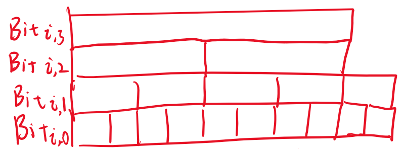
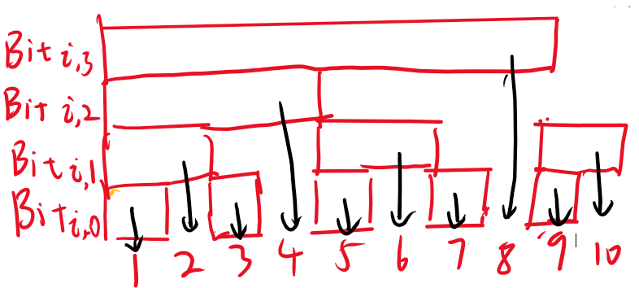
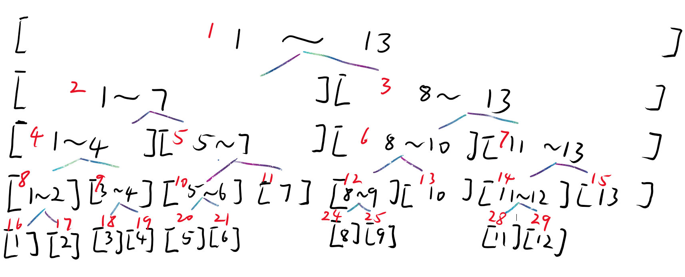

## 引言

给定一个数组$A$，我们需要对他进行各种各样的操作，例如**访问/修改单点**、**修改区间**、**查询区间性质**（如求和、最值...）等操作。

我们列举一些经典操作：**区间求和**、**区间修改**、**求区间最值**。
用这些经典操作，我们引入一系列数据结构，并对其进行复杂度分析。



## 前缀和

当我们需要进行**区间求和**的时候，对于普通数组$A$，我们直接将对应区间相加，时间复杂度为$O(N)$。但对于大批量的区间求和，这种做法显然不合适。
我们建立一个数组$Pre$，$Pre_i$表示从$A_1$到$A_i$的和，采用递推式$Pre_i=Pre_{i-1}+A_i$便可构造$Pre$。
这样的话，$A_l$到$A_r$的和便可以用  $Pre_r-Pre_{l-1}$   来快速得到。
**预处理时间**：$O(N)$
**区间求和时间**：$O(1)$
**空间**：$O(N)$

**二维扩展**：
对于二维数组$A_{i,j}$，我们同样维护$Pre_{i,j}$，表示从$(1,1)$到$(i,j)$的矩阵和。
查询$(a,b)$、$(c,d)$矩阵的和$(a\le c,b\le d)$，我们可以用
$$Pre_{c,d}-Pre_{c,b}-Pre_{a,d}+Pre_{a,b}$$来表示。(这里使用了**容斥**原理)



**前缀和可以看做离散数据的积分**，并且存在二次前缀和以及多次前缀和。


**但是**，如果我们需要对数据进行修改的话，$Pre$数组就需要重新维护，时间复杂度退化为O(N)。
那么有没有什么可以支持动态修改且能快速求区间和的数据结构呢？
有的，请移步后面的**树状数组**。

## 差分

当我们需要进行**区间修改**时，对于普通数组$A$，同样只有$O(N)$的复杂度，无法满足成规模的需求。
我们同样建立一个数组$Diff$，$Diff_i$表示$A_i-A_{i-1}$。那么$A_k=\sum\limits_{1}^{k}Diff_i$，也就是对$Diff$求前缀和。
我们想对$A_l$到$A_r$的所有数据增加$x$，进行操作 **$Diff_l$增加$x$，$Diff_{r+1}$减小$x$。**。
此时对$Diff$求前缀和：
- $i<l$处，$A_i$无变化。
- $l\le i\le r$处，$A_i$均增加了$x$。
- $i>r$处，$A_i$增大$x$又减小$x$，也无变化。

因此我们就完成了区间修改的操作。
**预处理时间**：$O(N)$
**区间修改时间**：$O(1)$
**还原数据时间**：$O(N)$
**空间**：$O(N)$



**差分可以看做离散数据的微分，也是前缀和的逆运算**，并且存在二次差分以及多次差分。


**但是**，我们从差分数组还原数据时，都要进行一次前缀和，如果还需要动态查询单点数据的话，这种复杂度也是不能接受的。我们同样需要快速求前缀和的数据结构，可以考虑**树状数组+差分**的组合。

## 树状数组

我们需要更高效的区间处理，就不能仅仅对只包含一个信息的$A_i$处理，我们将一部分$A$合并，从而对数据进行批量处理，减小时间复杂度。一个简单的方法就是按$2^n$大小来合并。
例如要求前缀和，我们建立数组$Bit_{i,j}$，以$2^j$为长度对数组$A$分块，其中第$i$个块，块内数据之和为$Bit_{i,j}$。那么$Bit_{i,0}$就是原数组$A_i$（$2^0=1$，以1为长度分块）。形成了如下的数据结构：

实际上这是一个**二叉树**。
**树状数组**的一个核心思想就是，删去了这种**二叉树**构造的**多余**数据，形成了一个线性数组。
为什么图中有数据多余呢？
比如$Bit_{2,0}$，我们可以用$Bit_{1,1}-Bit_{1,0}$来表示。
又如$Bit_{4,0}$，我们可以用$Bit_{1,2}-Bit_{1,1}-Bit_{3,0}$来表示。
因此，我们删去所有的非必要数据，就会得到如下结构：

此时，该二叉树变成了有N个节点的**多叉树**$Bit$。我们也能发现每一层中，只保留了奇数的块。在图中，我们把第i个数对应的块，其下方作为它的子节点，其上方作为它的父节点。（例如4的父节点为8，子节点为2、3。8的子节点为4、6、7）
我们先考虑这种结构有什么**性质**。
引入一个核心计算$$lowbit(x)=-x\And x$$ ($\And$为按位与运算，这个计算的结果是保留x的最后一位1开始后续的所有0)
对于一个数$6_{(10)}$，他的二进制表示为$110_{(2)}$，则$lowbit(110_{(2)})=10_{(2)}$。
- 对于第$x$个数，$lowbit(x)$表示为它对应块的长度。如$lowbit(8)=8$。
- 第$x$个数的父节点为$father=x+lowbit(x)$。从图中理解，由于只保留了奇数位置的块，我们往后延长一个与$x$块等长的大小$lowbit(x)$，就可以直接获取到其上方的块。
- 将$x$不断减少$lowbit(x)$，直到$0$，我们可以获得一些列数据，如$7\rightarrow 6\rightarrow 4\rightarrow 0$。我们如果将这些数对应的$Bit$加起来，就会发现我们求出了$x$的**前缀和**。例如$Pre_7=Bit_7+Bit_6+Bit_4$。

**非常神奇的性质。**
接下来考虑如何**预处理树状数组**。
实际上对于第$x$个数，它在树状数组中的值$Bit_x=A_x+\sum Bit_{son}$。
但是找到所有子节点是困难的，而且还要保证子节点$Bit_{son}$已经处理完了，因此我们反过来，复制$A$到$Bit$上后（即让$Bit_i$加上$A_i$），遍历$Bit_i$，**将$Bit_i$的值加到其父节点$Bit_{i+lowbit(i)}$上**。

获取前缀和的方法在上面的**第三条性质**。

接下来考虑**单点更新**。
我们修改第$x$个数据，就需要对他的所有祖先进行相应修改，因此不断增加$lowbit(x)$并作出对应修改即可。

**预处理时间**：$O(N)$
**区间求和时间**：$O(\log N)$
**单点修改时间**：$O(\log N)$
**空间**：$O(N)$



树状数组和前缀和一样仅支持**可逆运算**，因为树状数组删去的数据需要用其他元素来表示，如果不可逆，则无法还原数据。
树状数组可以支持的主要运算为：**区间加($+$)、区间异或($\oplus$)，区间积($\times$)。**（需要改为相应的前缀操作）
**特殊情况：求前缀最大值**。


**Code**
```cpp
//核心操作
inline int lowbit(int x){return -x&x;}
//构建树状数组
void build_Bit()
{
    for(int i=1;i<=N;i++)Bit[i]=A[i];
    for(int i=1;i<=N;i++)
    {
        if(i+lowbit(i)>N)continue;
        Bit[i+lowbit(i)]+=Bit[i];
    }
}
//单点修改
void Add(int x,int v)
{
    while(x<=N)
    {
        Bit[x]+=v;
        x+=lowbit(x);
    }
}
//前缀查询
int sum(int x)
{
    int rt=0;
    while(x)
    {
        rt+=Bit[x];
        x-=lowbit(x);
    }
    return rt;
}
```

## 线段树
**线段树的功能很强大，也比较好理解，但是代码量很大，比较难写**

我们同样对$A$进行分段，像二分一样每次将数据分成两半，使之成为一个二叉树。其中的每一个节点保存对应数据段的信息。形成如下形式：

**建立线段树（以区间和为例）**：
我们定义数组$segTree$，对于节点$i$，他的父节点$father=\lfloor i/2\rfloor$ ，他的左子节点$leftson=i\times 2$ ,他的右子节点$rightson=i\times 2+1$ 。不断**递归**构造下去，从而构造出$segTree$线段树。
- 对于叶子节点$x$，我们直接将$A$对应的数据赋值给他。
- 递归回溯时，我们将子节点的数据合并到父节点。（对于区间和，就是将两个子区间的和赋值给父节点）

**区间查询**：
建立好线段树后，我们如果需要查询区间 $[l,r]$的信息，同样从根节点1向下递归。
- 如果子节点区间**部分**包含$[l,r]$，那就进入该子节点，继续递归。
- 如果子节点区间**完全**包含$[l,r]$，那就直接获取该区间段的信息。（对于区间和，就是返回该段区间的和）

将所有获得的信息汇总，就得到了所查询区间的信息。例如查询区间 $[4,9]$，可以表示为$[4]+[5,7]+[8,9]$这三个区间的和。

**区间修改（引入$lazy$懒标记）**：
和区间查询一样，向下递归到对应的节点，然后对这些节点对应的区间进行整体修改。例如我们需要对$[4,9]$这个区间增加$x$，而$[4,9]$可以分解为$[4]+[5,7]+[8,9]$，那么我们就将区间$[4]$增加$x$，将区间$[5,7]$增加$3x$，将区间$[8,9]$增加$2x$。（系数为区间长度）
**但是**，我们这样并没有完全修改所有需要修改的值，比如区间$[8,9]$增加了$2x$，但是区间$[8][9]$并没有相应增加$x$，实际上这个步骤中，我们**偷懒**了。

因此我们引入**懒标记$lazy$**，表示在这一部分，我们没有向下继续更新区间。
在后续进行**区间查询**和**区间修改**操作时，如果我们遇到懒标记，就需要对懒标记进行下放，将之前偷懒的部分补充上去，从而保证数据的真实性。
下放懒标记的过程：
1. 将懒标记增加到两个子区间上，其对应子区间和需要增加区间长度$len\times lazy$。
2. 将$lazy$增加到两个子区间的$lazy$上。
3. 清空自身节点的$lazy$

**预处理时间**：$O(N)$
**区间查询时间**：$O(\log N)$
**区间修改时间**：$O(\log N)$
**空间**：$O(4N)$（防止越界，我们需要将数组大小开到4倍）

**懒标记是线段树的核心部分**，如果没有懒标记，我们就需要将数据一直更新到叶子节点，区间修改的**时间复杂度就会退化为$O(N\log N)$** 



线段树的**功能非常强大**，并且**可扩展性很强**，支持任意满足结合律的运算，支持任意区间修改操作，可以称为是区间问题的**通解**。


*这里的代码部分，我写了区间和以及区间最值*
**Code**
```cpp
struct Node
{
    int sum,maxv,minv;
    int lazy;
}segTree[maxn<<2];

//建树
void build(int x,int l,int r)
{
    segTree[x].lazy=0;
    if(l==r)
    {
        segTree[x]={A[l],A[l],A[l],0};
        return;
    }
    int mid=(l+r)>>1;
    int ls=x<<1,rs=x<<1|1;
    build(ls,l,mid);
    build(rs,mid+1,r);
    segTree[x].sum=segTree[ls].sum+segTree[rs].sum;
    segTree[x].maxv=max(segTree[ls].maxv,segTree[rs].maxv);
    segTree[x].minv=min(segTree[ls].minv,segTree[rs].minv);
}

//下放懒标记
void pushDown(int x,int l,int r)
{
    if(segTree[x].lazy==0)return;
    int lz=segTree[x].lazy;
    int mid=(l+r)>>1;
    int ls=x<<1,rs=x<<1|1;
    segTree[ls].sum+=(mid-l+1)*lz;
    segTree[ls].maxv+=lz;
    segTree[ls].minv+=lz;
    segTree[ls].lazy+=lz;
    segTree[rs].sum+=(r-mid)*lz;
    segTree[rs].maxv+=lz;
    segTree[rs].minv+=lz;
    segTree[rs].lazy+=lz;
    segTree[x].lazy=0;
}

//区间修改
void rangeAdd(int ql,int qr,int val,int x,int l,int r)
{
    if(ql<=l&&r<=qr)
    {

        segTree[x].sum+=(r-l+1)*val;
        segTree[x].maxv+=val;
        segTree[x].minv+=val;
        segTree[x].lazy+=val;
        return;
    }
    pushDown(x,l,r);
    int mid=(l+r)>>1;
    int ls=x<<1,rs=x<<1|1;
    if(ql<=mid)rangeAdd(ql,qr,val,ls,l,mid);
    if(qr>=mid+1)rangeAdd(ql,qr,val,rs,mid+1,r);
    segTree[x].sum=segTree[ls].sum+segTree[rs].sum;
    segTree[x].maxv=max(segTree[ls].maxv,segTree[rs].maxv);
    segTree[x].minv=min(segTree[ls].minv,segTree[rs].minv);
}

//区间查询
Node rangeQuery(int ql,int qr,int x,int l,int r)
{
    if(ql<=l&&r<=qr)return segTree[x];
    pushDown(x,l,r);
    Node res={0,-MAX,MAX,0};
    int mid=(l+r)>>1;
    int ls=x<<1,rs=x<<1|1;
    if(ql<=mid)
    {
        Node left=rangeQuery(ql,qr,ls,l,mid);
        res.sum+=left.sum;
        res.maxv=max(res.maxv,left.maxv);
        res.minv=min(res.minv,left.minv);
    }
    if(qr>=mid+1)
    {
        Node right=rangeQuery(ql,qr,rs,mid+1,r);
        res.sum+=right.sum;
        res.maxv=max(res.maxv,right.maxv);
        res.minv=min(res.minv,right.minv);
    }
    return res;
}

```